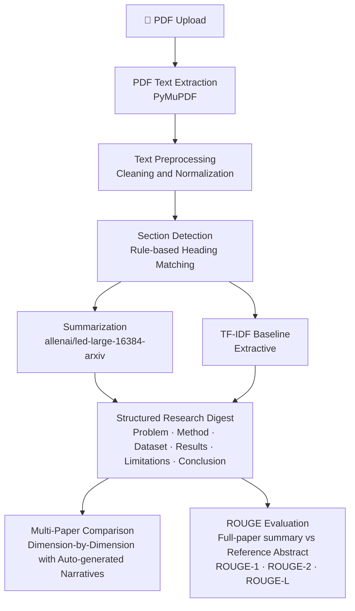

# PaperLens

### Structured Research Paper Summarization using Transformers

PaperLens is a research-paper analysis and summarization system that ingests
PDF research papers, detects their structural sections, generates concise
summaries using a long-document Transformer, and presents a structured digest
that can be compared across multiple papers.

---

## Key Features

| Feature | Description |
|---|---|
| 📄 PDF Ingestion | Upload 1–5 research paper PDFs via a Streamlit UI |
| 🔍 Text Extraction | High-fidelity text extraction using PyMuPDF |
| 🧩 Section Detection | Rule-based heading normalization into canonical sections |
| 🤖 Transformer Summarization | `allenai/led-large-16384-arxiv` for long-document abstractive summarization |
| 📋 Structured Digest | Per-paper output: Problem, Methodology, Dataset, Results, Limitations, Conclusion |
| 📊 Multi-Paper Comparison | Side-by-side comparison across up to 5 papers with auto-generated key differences |
| 📏 TF-IDF Baseline | Extractive baseline for comparison against the Transformer model |
| 🎯 ROUGE Evaluation | ROUGE-1, ROUGE-2, ROUGE-L against reference abstracts |

---

## Problem Statement

Research papers are long, technically dense, and time-consuming to read in full.
A researcher trying to survey a field must extract key information from dozens of papers —
identifying the problem each paper addresses, the method it proposes, the dataset it uses,
the results it reports, and its limitations.

This process is largely manual and does not scale. PaperLens addresses this by automating
the extraction and summarization of structured information from research paper PDFs,
and by enabling direct, dimension-by-dimension comparison across multiple papers.

---

## Solution Overview

PaperLens processes a research paper through a sequential pipeline:

1. **Extract** raw text from the PDF.
2. **Clean** extraction artifacts (hyphenation, noise, whitespace).
3. **Detect** section boundaries using rule-based heading patterns.
4. **Summarize** each section using a long-document Transformer (or TF-IDF baseline).
5. **Present** a structured digest per paper.
6. **Compare** multiple papers side by side with auto-generated key-difference and common-approach narratives.
7. **Evaluate** generated summaries using ROUGE against reference abstracts.

---

## System Architecture



---

## How It Works

### 1 — PDF Extraction
`src/pdf/extractor.py` uses **PyMuPDF (fitz)** to extract raw text from each page
of the uploaded PDF. PyMuPDF handles the vast majority of text-based academic PDFs
produced by LaTeX without requiring OCR.

### 2 — Text Preprocessing
`src/preprocessing/text_cleaner.py` removes PDF extraction artifacts:
hyphenated line breaks, control characters, redundant whitespace, and
optionally the bibliography section.

### 3 — Section Detection
`src/section_detection/detector.py` identifies section headings using regular
expression patterns and normalizes them into a fixed set of canonical labels:
`abstract`, `introduction`, `related_work`, `methodology`, `dataset`,
`experiments`, `results`, `discussion`, `limitations`, `conclusion`.
No machine-learning classifier is used.

### 4 — Summarization and Long-Document Handling
Each detected section (and the full paper text for ROUGE evaluation) is summarized:

- **LED Transformer:** `allenai/led-large-16384-arxiv` generates an abstractive
  summary. The summarizer first tokenizes the input to determine its length:
  - If the text fits within the configured token limit (default 16 384), it is
    passed to LED in a single forward pass — no truncation.
  - If it exceeds the limit, it is split into overlapping chunks (128-token overlap),
    each chunk summarized independently, and the chunk summaries are consolidated
    into a final summary in a second LED pass.  No content is silently discarded.
- **TF-IDF Baseline:** sentences are ranked by their TF-IDF scores and the
  top-k are returned as an extractive summary.

### 5 — Structured Digest
Section summaries are assembled into a structured digest covering six dimensions:
Problem, Methodology, Dataset, Results, Limitations, and Conclusion.

### 6 — Multi-Paper Comparison
`src/comparison/paper_comparator.py` aligns up to five paper digests on each
dimension and presents them in a side-by-side table.  It then generates:
- **Key differences** — extracted dataset names, method-specific vocabulary,
  and evaluation metrics unique to each paper, formatted as bullet points.
- **Common approaches** — shared methodological terms, shared task areas, and
  datasets referenced by all papers.
No additional model inference is performed; the narratives are derived directly
from the already-generated section summaries using vocabulary matching.

### 7 — ROUGE Evaluation

#### In-app evaluation (Streamlit)
The **full-paper summary** (generated by running the summarizer over the entire
cleaned paper text) is compared against the user-provided reference abstract.
This is the correct comparison: full document → summary vs. author abstract.

#### Benchmark evaluation (`experiments/evaluate.py`)
A separate script loads `ccdv/arxiv-summarization`, generates LED and TF-IDF
summaries for a configurable number of examples, and reports ROUGE-1/2/L for
both models. Results are saved to `results/evaluation_results.json`.

```bash
python experiments/evaluate.py --num-samples 10 --split test
python experiments/evaluate.py --num-samples 5 --tfidf-only   # fast run
```

---

## Model

PaperLens uses **[allenai/led-large-16384-arxiv](https://huggingface.co/allenai/led-large-16384-arxiv)**,
a **Longformer Encoder-Decoder (LED)** model fine-tuned on arXiv research papers.

**Why LED for research papers?**

Standard Transformer models (e.g., BART, T5) are limited to 512–1 024 tokens.
A full research paper typically runs to 5 000–12 000 words — far beyond that limit.
LED extends the Transformer architecture with a sparse local + global attention
mechanism (Longformer attention) that scales linearly with sequence length,
supporting up to **16 384 tokens**. This allows PaperLens to process substantially
longer paper sections without discarding large portions of the input.

The pretrained checkpoint `allenai/led-large-16384-arxiv` has already been
fine-tuned on the arXiv corpus for the summarization task and is used as-is,
without additional fine-tuning.

---

## Dataset

PaperLens uses the **[ccdv/arxiv-summarization](https://huggingface.co/datasets/ccdv/arxiv-summarization)**
dataset from the Hugging Face Hub (document configuration).

| Field | Role |
|---|---|
| `article` | Full research paper text (input) |
| `abstract` | Author-written abstract (reference summary for ROUGE evaluation) |

This dataset is used for benchmark evaluation: the model is given the full article
text and its output is compared against the abstract using ROUGE metrics.
The dataset is downloaded at runtime and is not committed to this repository.

---

## Baseline

A **TF-IDF extractive baseline** (`src/summarization/tfidf_baseline.py`) is
provided to contextualize the Transformer model's performance.

Sentences are scored by the sum of their TF-IDF weights (using `scikit-learn`'s
`TfidfVectorizer`) and the top-k sentences, in document order, form the
extractive summary. No model inference is required, making it fast and
interpretable.

---

## Evaluation

Summaries generated by LED and the TF-IDF baseline are evaluated against
reference abstracts using three standard ROUGE variants:

| Metric | What it measures |
|---|---|
| **ROUGE-1** | Unigram overlap between generated and reference summary |
| **ROUGE-2** | Bigram overlap |
| **ROUGE-L** | Longest common subsequence — captures fluency and sentence-level structure |

The in-app evaluation compares the **full-paper LED or TF-IDF summary** against
the user-provided reference abstract, not a single section's summary.

In addition to automatic ROUGE scoring, qualitative evaluation considers:
- **Factuality** — does the summary accurately reflect the paper?
- **Coverage** — are key contributions included?
- **Coherence** — is the summary readable and well-structured?
- **Redundancy** — are sentences unnecessarily repeated?
- **Hallucination** — does the summary introduce claims not present in the paper?

---

## Project Structure

```
PaperLens/
│
├── app/
│   ├── __init__.py
│   └── streamlit_app.py        # Streamlit web interface
│
├── src/
│   ├── __init__.py
│   ├── pdf/
│   │   ├── __init__.py
│   │   └── extractor.py        # PDF text extraction (PyMuPDF)
│   ├── preprocessing/
│   │   ├── __init__.py
│   │   └── text_cleaner.py     # Cleaning and normalization
│   ├── section_detection/
│   │   ├── __init__.py
│   │   └── detector.py         # Rule-based section detection
│   ├── summarization/
│   │   ├── __init__.py
│   │   ├── led_summarizer.py   # LED Transformer with chunking strategy
│   │   └── tfidf_baseline.py   # TF-IDF extractive baseline
│   ├── comparison/
│   │   ├── __init__.py
│   │   └── paper_comparator.py # Multi-paper comparison with auto narratives
│   └── evaluation/
│       ├── __init__.py
│       └── rouge_evaluator.py  # ROUGE-1/2/L scoring
│
├── data/
│   ├── raw/                    # Raw PDF uploads (gitignored)
│   ├── processed/              # Intermediate outputs (gitignored)
│   └── samples/                # Sample PDFs for testing (gitignored)
│
├── experiments/
│   ├── evaluate.py             # Benchmark evaluation script
│   └── README.md
│
├── notebooks/                  # Exploratory notebooks (gitignored)
├── results/                    # Evaluation outputs (gitignored)
│
├── tests/
│   ├── __init__.py
│   ├── conftest.py             # Shared pytest fixtures (minimal PDF builder)
│   ├── test_extractor.py       # PDF extraction tests
│   ├── test_detector.py        # Section detection tests
│   ├── test_tfidf_baseline.py  # TF-IDF summarizer tests
│   ├── test_paper_comparator.py # Multi-paper comparison tests
│   ├── test_rouge_evaluator.py # ROUGE metric tests
│   ├── test_pipeline_e2e.py    # End-to-end pipeline test (no GPU required)
│   └── README.md
│
├── configs/
│   └── config.yaml             # Pipeline configuration
│
├── .gitignore
├── requirements.txt
├── README.md
└── LICENSE
```

---

## Tech Stack

| Component | Technology |
|---|---|
| Language | Python 3.10+ |
| Deep Learning | PyTorch |
| Transformer Model | Hugging Face Transformers |
| Dataset | Hugging Face Datasets |
| Evaluation | Hugging Face Evaluate / rouge-score |
| PDF Extraction | PyMuPDF (fitz) |
| TF-IDF | scikit-learn |
| Web Interface | Streamlit |
| Configuration | PyYAML |

---

## Installation

```bash
# 1. Clone the repository
git clone https://github.com/<your-username>/PaperLens.git
cd PaperLens

# 2. Create and activate a virtual environment
python -m venv .venv

# Windows
.venv\Scripts\activate

# macOS / Linux
source .venv/bin/activate

# 3. Install dependencies
pip install -r requirements.txt
```

> **Note:** The LED model weights (~1.6 GB) are downloaded automatically by
> Hugging Face Transformers on the first run and cached locally.
> They are not stored in this repository.

---

## Usage

### Start the Streamlit application

```bash
streamlit run app/streamlit_app.py
```

Open the URL shown in the terminal (typically `http://localhost:8501`) in your browser.

### Run the benchmark evaluation

```bash
# Evaluate both LED and TF-IDF on 10 test examples
python experiments/evaluate.py --num-samples 10

# Fast TF-IDF-only run (no GPU needed)
python experiments/evaluate.py --num-samples 50 --tfidf-only

# Choose a specific split
python experiments/evaluate.py --num-samples 5 --split validation
```

### Run the test suite

```bash
pytest tests/ -v
```

---

## Example Workflow

```
1. Upload PDF(s)     →  Drag and drop 1–5 research paper PDFs
2. Select summarizer →  LED (Transformer) or TF-IDF (Baseline)
3. Analyze           →  Pipeline runs automatically
4. View digest       →  Structured output per paper
5. Compare papers    →  Side-by-side dimension table (2–5 papers)
                         + auto-generated key differences and common approaches
6. Evaluate          →  Paste a reference abstract to get ROUGE scores
                         (scored against the full-paper summary, not a single section)
```

---

## Academic Context

PaperLens was developed as the course project for **CSE472 — Deep Learning for
Natural Language Processing**. The project applies long-document Transformer
models to the real-world task of research paper summarization and structured
information extraction, with a focus on interpretable pipeline design and
rigorous evaluation.

---

## Future Improvements

- Improved section detection using learned heading classifiers trained on structured
  arXiv metadata.
- Section-level ROUGE evaluation (per section rather than abstract-level only).
- Citation and figure extraction to enrich the structured digest.
- Export of comparison reports to PDF or structured JSON.

---

## License

This project is licensed under the MIT License. See [LICENSE](LICENSE) for details.
