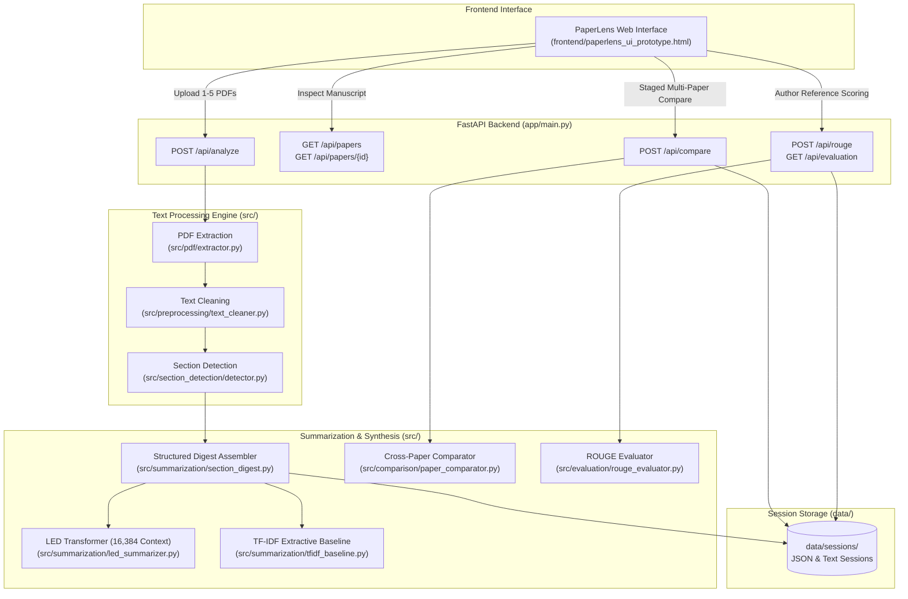

# PaperLens

### Structured Research Paper Analysis & Summarization Intelligence Platform

PaperLens is an end-to-end academic research intelligence platform designed to ingest PDF research manuscripts, extract and clean text, detect canonical structural sections, generate abstractive and extractive summaries using a long-document Transformer and TF-IDF baseline, and synthesize insights across multiple papers.

The platform provides a high-performance **FastAPI** backend coupled with a dedicated editorial web interface, delivering structured **Research Briefs**, technical **Deep Dives**, cross-paper **Research Synthesis**, and an **Evaluation Workspace** with automated ROUGE scoring.

---

## Key Features

| Capability | Technical Implementation | Description |
|---|---|---|
| **PDF Ingestion** | PyMuPDF (`fitz`) | Multi-page PDF text extraction with stream handling and formatting preservation |
| **Artifact Cleaning** | Rule-based regex pipeline | De-hyphenation, ligature normalization, control character stripping, bibliography pruning |
| **Section Detection** | Regex pattern matching | Maps paper headings to canonical labels (`abstract`, `introduction`, `methodology`, `results`, `limitations`, `conclusion`, etc.) |
| **Neural Summarization** | `allenai/led-large-16384-arxiv` | Longformer Encoder-Decoder with sparse local/global attention handling up to 16,384 tokens |
| **Hierarchical Chunking** | Overlapping token chunking + consolidation | Partitions documents exceeding 16,384 tokens into bounded overlapping windows and consolidates chunk digests in a secondary pass |
| **Extractive Baseline** | `scikit-learn` TF-IDF | Sentence salience ranking providing an interpretable, non-neural comparative baseline |
| **Structured Research Brief** | Extraction synthesis | Standardized breakdown: Problem, Methodology, Key Findings, Limitations, Conclusion |
| **Cross-Paper Synthesis** | Multi-document matrix alignment | Side-by-side comparison (2–5 papers) with automated key differences and common approach extraction |
| **Evaluation Workspace** | `rouge-score` / Hugging Face `evaluate` | Benchmark summaries against author ground truth across ROUGE-1, ROUGE-2, and ROUGE-L |

---

## System Architecture


```mermaid
flowchart TD
    subgraph Client["Frontend Interface"]
        UI["PaperLens Web Interface\n(frontend/paperlens_ui_prototype.html)"]
    end

    subgraph API["FastAPI Backend (app/main.py)"]
        UploadRoute["POST /api/analyze"]
        PapersRoute["GET /api/papers\nGET /api/papers/{id}"]
        CompareRoute["POST /api/compare"]
        RougeRoute["POST /api/rouge\nGET /api/evaluation"]
    end

    subgraph Ingestion["Text Processing Engine (src/)"]
        Extract["PDF Extraction\n(src/pdf/extractor.py)"]
        Clean["Text Cleaning\n(src/preprocessing/text_cleaner.py)"]
        Detect["Section Detection\n(src/section_detection/detector.py)"]
    end

    subgraph Models["Summarization & Synthesis (src/)"]
        LED["LED Transformer (16,384 Context)\n(src/summarization/led_summarizer.py)"]
        TFIDF["TF-IDF Extractive Baseline\n(src/summarization/tfidf_baseline.py)"]
        Digest["Structured Digest Assembler\n(src/summarization/section_digest.py)"]
        Compare["Cross-Paper Comparator\n(src/comparison/paper_comparator.py)"]
        Eval["ROUGE Evaluator\n(src/evaluation/rouge_evaluator.py)"]
    end

    subgraph Storage["Session Storage (data/)"]
        Sessions[("data/sessions/\nJSON & Text Sessions")]
    end

    UI -->|Upload 1-5 PDFs| UploadRoute
    UI -->|Inspect Manuscript| PapersRoute
    UI -->|Staged Multi-Paper Compare| CompareRoute
    UI -->|Author Reference Scoring| RougeRoute

    UploadRoute --> Extract --> Clean --> Detect
    Detect --> Digest
    Digest --> TFIDF
    Digest --> LED
    Digest --> Sessions

    CompareRoute --> Sessions
    CompareRoute --> Compare

    RougeRoute --> Eval
    RougeRoute --> Sessions
```

---

## How It Works

### 1. High-Fidelity PDF Text Extraction
Raw academic manuscripts are ingested via `src/pdf/extractor.py` using **PyMuPDF (`fitz`)**. The extractor iterates through document pages, extracting character-accurate text streams without external OCR dependencies, reliably parsing LaTeX-generated two-column and single-column preprints.

### 2. Preprocessing & Normalization
Extraction artifacts are cleaned via `src/preprocessing/text_cleaner.py`:
- De-hyphenates line breaks split across words (e.g., `trans-\nformer` → `transformer`).
- Removes redundant carriage returns, form feeds, and non-printable control characters.
- Normalizes irregular whitespace while preserving semantic paragraph boundaries.
- Trims trailing acknowledgments and reference lists when targeted.

### 3. Rule-Based Section Boundary Detection
Academic papers follow established discourse patterns. `src/section_detection/detector.py` scans text for numbered, Roman-numeral, and unnumbered section headings using robust regular expressions, mapping them into canonical taxonomy buckets:
- `abstract`
- `introduction`
- `related_work`
- `methodology`
- `dataset`
- `experiments` / `results`
- `discussion`
- `limitations`
- `conclusion`

### 4. Long-Document Transformer Summarization & Hierarchical Chunking
Abstractive summarization is powered by **`allenai/led-large-16384-arxiv`**:
- **Native 16K Window**: Uses Longformer sparse local attention combined with global attention placed on the leading `<s>` token, scaling linearly with document length.
- **Hierarchical Chunking Strategy**: For documents exceeding the 16,384-token window, text is partitioned into overlapping chunks (128-token boundary overlap). Each chunk is summarized independently, followed by a second-stage consolidation pass through LED to synthesize a unified document summary while preserving context across chunk boundaries.

### 5. TF-IDF Extractive Baseline
As an interpretable non-neural reference point, `src/summarization/tfidf_baseline.py` uses `scikit-learn` to fit a `TfidfVectorizer` across sentence candidates, ranking sentences by cumulative token importance and selecting top-$k$ sentences in original document order.

### 6. Multi-Paper Research Synthesis
`src/comparison/paper_comparator.py` stages 2 to 5 manuscripts and aligns them across 6 key dimensions (Problem, Methodology, Dataset, Results, Limitations, Conclusion). It extracts:
- **Common Approaches**: Shared methodological terms, task areas, and datasets.
- **Key Differences**: Contrasting techniques, unique metrics, and divergent experimental setups.

### 7. Evaluation & Ground-Truth Benchmarking
`src/evaluation/rouge_evaluator.py` computes standard overlap metrics against author ground-truth abstracts:
- **ROUGE-1**: Unigram overlap (content coverage).
- **ROUGE-2**: Bigram overlap (phrasal fluency).
- **ROUGE-L**: Longest common subsequence (structural sentence coherence).

---

## Empirical Benchmark Results

### 1. Test-Set Benchmark (First 50 Papers of `ccdv/arxiv-summarization`)
The summarization pipeline was benchmarked against reference abstracts on the first 50 papers of the `ccdv/arxiv-summarization` test split.

> [!NOTE]
> The table below reflects preliminary validation on the first 50 papers of the official test split, not the entire test corpus.

| Model / Approach | ROUGE-1 | ROUGE-2 | ROUGE-L | Summary Type | Compute Profile |
|---|---|---|---|---|---|
| **TF-IDF Baseline** | 0.2971 | 0.0838 | 0.1492 | Extractive (Top-3 sentences) | Lightweight CPU execution |
| **LED (`allenai/led-large-16384-arxiv`)** | **0.4351** | **0.1887** | **0.2730** | Abstractive Neural Summary | Transformer inference (GPU accelerated) |

LED achieves substantial gains over the extractive baseline across all three metrics (+13.8 ROUGE-1, +10.5 ROUGE-2, +12.4 ROUGE-L), confirming the effectiveness of specialized long-document attention for capturing academic discourse.

### 2. Long-Document Stress Test (>16,384 Tokens)
To test the hierarchical chunking architecture under memory-constrained conditions, the pipeline was evaluated on long-form preprint manuscripts:

- **Test Manuscript**: BERT publication (`1810.04805.pdf`), containing **18,265 tokens**.
- **Chunking Behavior**: Automatically partitioned into **2 overlapping chunks** (16,384 token window + 128 overlap) $\rightarrow$ independently summarized $\rightarrow$ consolidated in a secondary pass.
- **Hardware Profile**: Evaluated on an **NVIDIA GeForce RTX 4050 Laptop GPU** (6 GB VRAM).
- **Execution Profile**: Successfully completed without out-of-memory errors or NaN activations, operating at a peak VRAM footprint of approximately **4.2 GB** on the evaluated hardware.

---

## Project Structure

```
PaperLens/
│
├── app/
│   ├── __init__.py
│   ├── main.py                     # FastAPI application entrypoint (routes, CORS, static)
│   ├── pipeline.py                 # Pipeline coordinator (orchestrates ingestion & caching)
│   └── routers/
│       ├── __init__.py
│       ├── papers.py               # /api/analyze, /api/papers, /api/papers/{id}
│       ├── compare.py              # /api/compare cross-paper synthesis route
│       └── evaluation.py           # /api/evaluation aggregate ROUGE statistics route
│
├── frontend/
│   └── paperlens_ui_prototype.html # Modern single-page web interface (Brief, Deep Dive, Compare, Eval)
│
├── src/
│   ├── __init__.py
│   ├── pdf/
│   │   ├── __init__.py
│   │   └── extractor.py            # High-fidelity PDF extraction (PyMuPDF)
│   ├── preprocessing/
│   │   ├── __init__.py
│   │   └── text_cleaner.py         # De-hyphenation, text sanitization, normalization
│   ├── section_detection/
│   │   ├── __init__.py
│   │   └── detector.py             # Rule-based regex section header detector
│   ├── summarization/
│   │   ├── __init__.py
│   │   ├── led_summarizer.py       # LED Transformer with hierarchical chunking
│   │   ├── section_digest.py       # Six-dimension structured digest constructor
│   │   └── tfidf_baseline.py       # TF-IDF extractive baseline summarizer
│   ├── comparison/
│   │   ├── __init__.py
│   │   └── paper_comparator.py     # Cross-document alignment & narrative generation
│   └── evaluation/
│       ├── __init__.py
│       └── rouge_evaluator.py      # ROUGE-1, ROUGE-2, and ROUGE-L metric calculator
│
├── configs/
│   └── config.yaml                 # Core configuration (model name, tokens, chunking, thresholds)
│
├── data/
│   ├── raw/                        # Uploaded PDFs (gitignored, preserved via .gitkeep)
│   ├── processed/                  # Intermediate processing artifacts (gitignored)
│   ├── sessions/                   # JSON session cache per manuscript (gitignored)
│   └── samples/                    # Sample paper PDFs for benchmark validation (.gitkeep tracked)
│
├── experiments/
│   ├── evaluate.py                 # ArXiv summarization benchmark harness
│   └── README.md                   # Experiment logging guidelines
│
├── scripts/
│   ├── audit_benchmark.py          # Benchmark JSON integrity verification
│   ├── benchmark_led.py            # Automated LED evaluation harness
│   ├── benchmark_led_2.py          # Multi-paper arXiv benchmark harness
│   ├── check_dataset.py            # Hugging Face dataset accessibility check
│   ├── run_pipeline_test.py        # Pipeline validation script
│   ├── test_backend_e2e.py         # End-to-end FastAPI integration test
│   ├── test_bert.py                # Standalone extraction test
│   ├── test_led_16k.py             # Long-document chunking stress test
│   └── test_led_small.py           # LED model sanity check
│
├── tests/
│   ├── __init__.py
│   ├── conftest.py                 # Pytest fixtures (in-memory PDF generator)
│   ├── test_extractor.py           # Unit tests: PyMuPDF extraction
│   ├── test_detector.py            # Unit tests: Section detection & heading normalization
│   ├── test_tfidf_baseline.py      # Unit tests: TF-IDF extractive baseline
│   ├── test_section_digest.py      # Unit tests: Structured digest assembly
│   ├── test_paper_comparator.py    # Unit tests: Multi-paper comparator
│   ├── test_rouge_evaluator.py     # Unit tests: ROUGE metric correctness
│   ├── test_pipeline_e2e.py        # Integration test: Complete pipeline without GPU
│   └── README.md
│
├── .gitignore                      # Comprehensive ignore rules for caches, PDFs, and envs
├── DESIGN.md                       # Design system and typography specifications
├── requirements.txt                # Production and development dependencies
├── README.md                       # Repository documentation
└── LICENSE                         # MIT License
```

---

## Quick Start

### 1. Prerequisites
- Python 3.10, 3.11, or 3.12
- Optional: CUDA-compatible GPU (NVIDIA GPU with 4+ GB VRAM recommended for local LED inference)

### 2. Environment Setup

```bash
# Clone the repository
git clone https://github.com/bhanusiingh/PaperLens.git
cd PaperLens

# Create a virtual environment
python -m venv .venv

# Activate the virtual environment
# Windows (PowerShell):
.venv\Scripts\Activate.ps1
# Windows (Command Prompt):
.venv\Scripts\activate.bat
# macOS / Linux:
source .venv/bin/activate

# Install dependencies
pip install -r requirements.txt
```

### 3. Launch the Application

```bash
uvicorn app.main:app --reload
```

Open your browser and navigate to:
```text
http://127.0.0.1:8000
```

- The interactive single-page application loads automatically from `/`.
- Interactive FastAPI OpenAPI documentation is available at `http://127.0.0.1:8000/docs`.

---

## API Reference

| Method | Endpoint | Request Payload | Response | Description |
|---|---|---|---|---|
| `POST` | `/api/analyze` | `multipart/form-data` (`files`: 1–5 PDFs) | JSON list of paper session objects | Runs extraction, section detection, TF-IDF baseline, and digest generation |
| `GET` | `/api/papers` | None | JSON list of all completed paper sessions | Retrieves active session library |
| `GET` | `/api/papers/{paper_id}` | Path param: `paper_id` | Full JSON session object | Fetches complete document breakdown, digests, and summaries |
| `DELETE` | `/api/papers/{paper_id}` | Path param: `paper_id` | `{ "status": "deleted" }` | Deletes session cache and staged files |
| `POST` | `/api/compare` | `{ "paper_ids": ["id1", "id2"] }` (2–5 IDs) | Structured comparison report | Generates side-by-side dimensional matrix and narrative analysis |
| `POST` | `/api/rouge` | `{ "paper_id": "id", "reference_abstract": "text" }` | `{ "led": {...}, "tfidf": {...} }` | Scores LED and TF-IDF summaries against author ground truth |
| `GET` | `/api/evaluation` | None | `{ "averages": {...}, "papers": [...] }` | Aggregate ROUGE metrics across all evaluated manuscripts |

---

## Running Tests

PaperLens includes a self-contained unit and integration test suite that executes without requiring GPU hardware or downloading the 1.6 GB Transformer model weights.

### Run Unit and Integration Tests

```bash
pytest tests/ -v
```

The automated test suite executes across unit and integration tests using isolated in-memory PDF fixtures generated on the fly, verifying PDF extraction, text cleaning, section detection, TF-IDF baseline generation, multi-paper comparison, and ROUGE evaluation.

### Optional GPU & End-to-End Benchmark Tests

> [!NOTE]
> Tests utilizing `LEDLargeForConditionalGeneration` download weights (~1.6 GB) from the Hugging Face Hub upon first execution and require an environment with sufficient GPU memory or CPU execution time.

```bash
# Verify end-to-end FastAPI integration with a sample PDF
python scripts/test_backend_e2e.py

# Verify long-document chunking (>16K tokens)
python scripts/test_led_16k.py

# Run benchmark evaluation across arXiv test samples
python experiments/evaluate.py --num-samples 10
```

---

## Academic Context

PaperLens was developed as the course project for **CSE472 — Deep Learning for Natural Language Processing**. The system investigates sparse-attention Transformer architectures for long-form document summarization, tackling challenges in sequence length scaling, section discourse modeling, and multi-document comparative synthesis.

---

## License

This project is licensed under the MIT License — see the [LICENSE](LICENSE) file for details.
